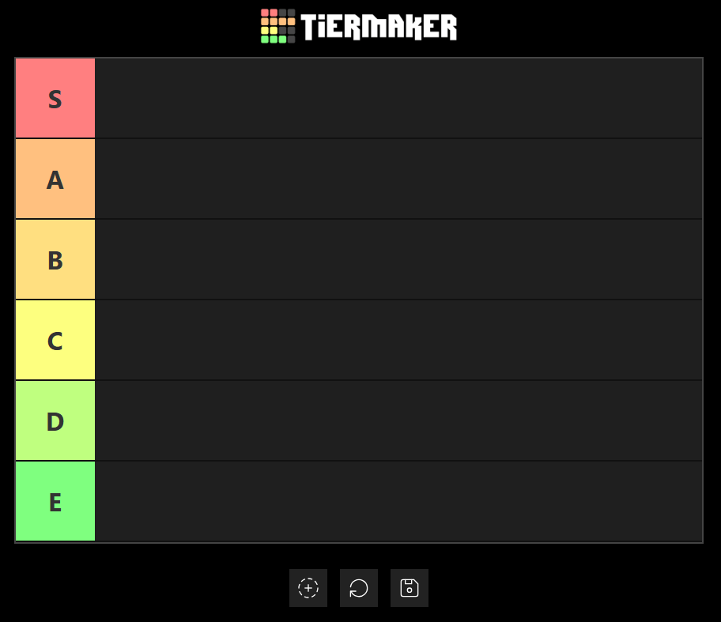

# 🧱 Tierlist Maker JS

  

  
  
  
  

  
  
  

---

🌐 **Try it here:**  
👉 https://alobuuls.github.io/tierlist-maker/

---

## 🎨 Description

🧱 **Tierlist Maker** is a web app built with **vanilla JavaScript** that lets you create custom tier lists by **dragging and dropping images** into ranked rows.

You can upload files from your device, drag them from your desktop, reorder them freely, and export your final tierlist as an image.

---

## 📖 About the project

This project was created to practice:

- 🧲 Drag & Drop API  
- 📂 FileReader and desktop file handling  
- 🧠 DOM manipulation  
- 🎨 Canvas rendering  
- 📤 Client-side export  

Everything runs 100% in the browser — no backend required.

---

## ✨ Features

- 📂 Upload images from your device  
- 🖥️ Drag images directly from your desktop  
- 🧲 Drag & drop between tier rows  
- 👀 Visual drag preview  
- 🔄 Reset tier and restore items  
- 💾 Export tierlist as PNG  
- ⚡ Real-time DOM updates  

---

## 🕹 How to use

1. 📂 Upload images or drag them from your desktop  
2. 🧲 Drag each image into the tier rows  
3. 🔀 Rearrange items as you like  
4. 💾 Click **Save** to download your tierlist  
5. 🔄 Click **Reset** to start again  

---

## 🛠 Technologies

- 🌐 HTML5  
- 🎨 CSS3  
- ⚡ JavaScript (ES6)  
- 🧲 Drag & Drop API  
- 🖼️ Canvas / html2canvas  

---

## 🎯 Goal

🎓 Practice advanced DOM logic, drag-and-drop systems, file handling, and exporting UI as images using only JavaScript.
