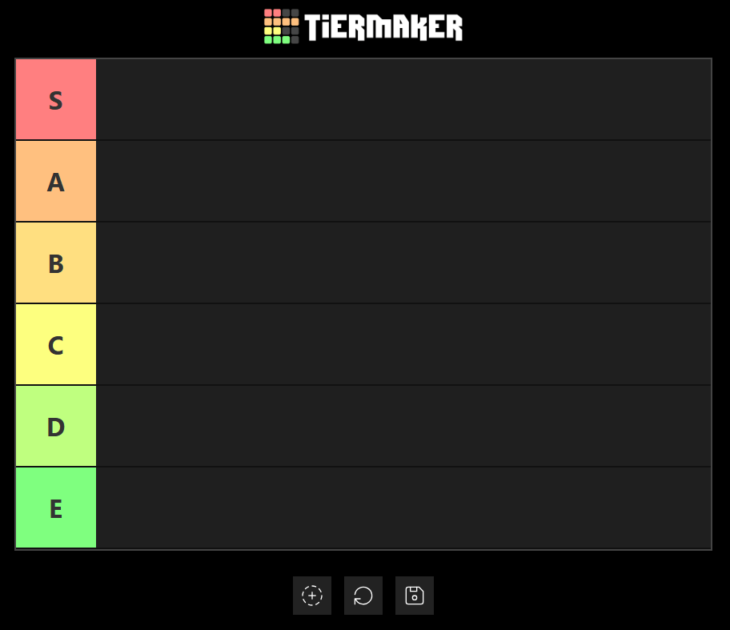

# 🧱 Tierlist Maker JS

<p align="center">
  
</p>

<p align="center">
  
  
  
  
  
</p>

<p align="center">
  <a href="https://github.com/alobuuls/tierlist-maker" target="_blank"></a>
  <a href="https://github.com/alobuuls/tierlist-maker/stargazers" target="_blank"></a>
  <a href="https://github.com/alobuuls/tierlist-maker/commits/main" target="_blank"></a>
</p>

---

## 📑 Table of Contents

* [🧱 Tierlist Maker JS](#-tierlist-maker-js)

  * [📑 Table of Contents](#-table-of-contents)

  * [🌐 Live Demo](#-live-demo)

  * [📖 Description](#-description)

  * [⚙️ System Requirements](#️-system-requirements)

  * [🔍 Verify Installation](#-verify-installation)

  * [🚀 Project Installation](#-project-installation)

    * [1️⃣ Clone the repository](#1️⃣-clone-the-repository)
    * [2️⃣ Open the project](#2️⃣-open-the-project)

  * [▶️ Run the Project](#️-run-the-project)

  * [🧠 Project Architecture](#-project-architecture)

    * [📦 Core Modules](#-core-modules)

      * [Tier Management](#tier-management)
      * [Drag & Drop System](#drag--drop-system)
      * [Image Upload Module](#image-upload-module)
      * [Export System](#export-system)

  * [✨ Features](#-features)

  * [🛠 Technologies Used](#-technologies-used)

  * [📁 Project Structure](#-project-structure)

  * [🔥 Best Practices Implemented](#-best-practices-implemented)

  * [🎯 Project Goal](#-project-goal)

  * [📄 License](#-license)

---

## 🌐 Live Demo

🔗 https://alobuuls.github.io/tierlist-maker/

---

## 📖 Description

> [!NOTE]
> Tierlist Maker JS is an interactive web application built with HTML, CSS, and Vanilla JavaScript.

The project allows users to create custom tier lists by uploading images, dragging and dropping them between ranking tiers, reorganizing items dynamically, and exporting the final result as an image directly from the browser.

---

## ⚙️ System Requirements

Before running the project, make sure you have:

* 🌐 A modern web browser (Chrome, Firefox, Edge, Safari)
* 📦 Git (optional)

---

## 🔍 Verify Installation

Check that Git is installed:

```bash
git --version
```

---

## 🚀 Project Installation

### 1️⃣ Clone the repository

```bash
git clone git@github.com:alobuuls/tierlist-maker.git

cd tierlist-maker
```

### 2️⃣ Open the project

> [!IMPORTANT]
> No dependencies or package installation are required.

You can simply open:

```text
index.html
```

or run the project using Live Server in Visual Studio Code.

---

## ▶️ Run the Project

Open the `index.html` file directly in your browser.

---

## 🧠 Project Architecture

> [!NOTE]
> The application is built using Vanilla JavaScript and browser APIs to provide a complete drag-and-drop experience without external frameworks.

### 📦 Core Modules

#### Tier Management

Responsible for:

* Tier creation
* Item organization
* Dynamic ranking
* State updates

#### Drag & Drop System

Handles:

* Image dragging
* Drop zones
* Item repositioning
* Visual feedback

#### Image Upload Module

Manages:

* Local file uploads
* Desktop drag-and-drop files
* FileReader integration
* Dynamic image generation

#### Export System

Controls:

* Tierlist capture
* PNG generation
* Client-side export
* Download functionality

---

## ✨ Features

* 📂 Upload images from your device
* 🖥️ Drag images directly from your desktop
* 🧲 Drag & drop between tier rows
* 🔀 Reorder items dynamically
* 👀 Visual drag feedback
* 💾 Export tierlist as PNG
* 🔄 Reset and restore items
* ⚡ Real-time DOM updates
* 📋 Custom tier ranking system
* 🚀 Lightweight implementation without frameworks

---

## 🛠 Technologies Used

| Technology        | Purpose             |
| ----------------- | ------------------- |
| HTML5             | Structure           |
| CSS3              | Styling             |
| JavaScript (ES6+) | Functionality       |
| Drag & Drop API   | Item Movement       |
| FileReader API    | Local File Handling |
| DOM API           | DOM Manipulation    |
| html2canvas       | Image Export        |

---

## 📁 Project Structure

```text
tierlist-maker/
├── index.html
├── main.js
├── styles.css
├── preview.png
└── README.md
```

---

## 🔥 Best Practices Implemented

* Separation of responsibilities
* Event-driven architecture
* Dynamic DOM manipulation
* Browser API integration
* Client-side file processing
* Reusable functions
* State synchronization
* Clean code organization
* Responsive user interactions
* Framework-free implementation

---

## 🎯 Project Goal

Practice and strengthen advanced front-end development concepts through the creation of an interactive tier list application:

* Drag & Drop API
* DOM Manipulation
* Event Handling
* File Processing
* State Management
* Dynamic Rendering
* Browser APIs
* Client-side Export
* User Experience Design
* Vanilla JavaScript Architecture

---

## 📄 License

This project is intended for educational and portfolio purposes.

Created by **Alondra Francisco Onofre**.
